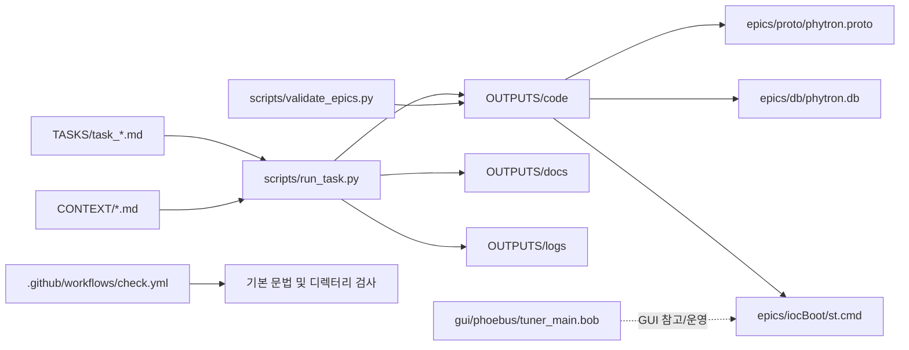

# EPICS AI Harness for Phytron MCC-1 MINI-W-ETH


이 저장소는 Phytron `MCC-1 MINI-W-ETH` 장비를 대상으로 EPICS IOC 초안, StreamDevice 프로토콜, GUI 파일, 작업 문서, 검증 로그를 함께 관리하기 위한 작업용 하네스입니다.

현재 구성은 "실장비 명령 캡처 + IOC scaffold 생성 + 문서화 + Codex 보조 작업"에 초점이 맞춰져 있으며, 완성된 제품형 IOC보다는 검증 가능한 개발 작업공간에 가깝습니다.

## 프로젝트 소개

이 프로젝트는 아래 작업을 한 저장소 안에서 이어갈 수 있도록 구성되어 있습니다.

- Phytron 제어 명령 및 응답 프레임 정리
- EPICS `db`, `proto`, `st.cmd` 초안 생성
- CSS Phoebus GUI 파일 관리
- 작업 요청(`TASKS`)과 시스템 배경지식(`CONTEXT`) 기반 자동 생성
- 실행 로그와 결과 문서 보관

즉, 단순 코드 저장소가 아니라 "EPICS + 문서 + Codex 자동화 흐름"을 함께 담는 작업형 저장소입니다.

## 목표

- Phytron MCC-1 MINI-W-ETH용 EPICS IOC 초안을 일관된 구조로 관리
- 프로토콜, DB, startup script를 분리해 검증과 수정이 쉽게 유지
- 실측 캡처와 문서 기반으로 명령어를 점진적으로 검증
- Codex를 이용해 `TASKS`에서 `OUTPUTS`까지 생성 흐름을 자동화
- Git/GitHub 기반으로 변경 이력과 작업 단위를 명확히 관리

## 주요 기능 (Key Features)

- `TASKS/` + `CONTEXT/` 기반 코드 생성
  - `scripts/run_task.py`가 프롬프트를 조합하고 생성 결과를 `OUTPUTS/`에 저장합니다.
- StreamDevice 기반 EPICS 구조 유지
  - `epics/proto/phytron.proto`
  - `epics/db/phytron.db`
  - `epics/iocBoot/st.cmd`
- 자동 검증 스크립트 포함
  - `scripts/validate_epics.py`가 필수 파일, PV, proto block, 매크로 전달 여부를 확인합니다.
- 작업 감시 스크립트 포함
  - `scripts/watch_tasks.py`가 `TASKS/task_*.md` 변경을 감시해 자동 실행 흐름을 지원합니다.
- GUI 초안 파일 포함
  - `gui/phoebus/tuner_main.bob`
- 문서와 캡처 결과 축적
  - `CONTEXT/`에는 명령 매핑, 검증 프레임, 캡처 로그가 정리되어 있습니다.
  - `OUTPUTS/docs`, `OUTPUTS/logs`에는 생성 기록과 검증 로그가 남습니다.

## 시스템 아키텍처



위 구조에서 핵심은 `TASKS`와 `CONTEXT`를 입력으로 받아, 생성 결과를 `OUTPUTS`에 축적하고, 검증 가능한 초안을 `epics/` 구조에 반영하는 흐름입니다.

## 디렉터리 구조

| 디렉터리 | 설명 |
| --- | --- |
| `epics/` | EPICS 관련 정리본. `db`, `proto`, `iocBoot` 구조를 분리해 둔 디렉터리 |
| `gui/` | CSS Phoebus GUI 파일 및 관련 자료 |
| `scripts/` | 작업 자동화, 태스크 실행, 검증, watcher 스크립트 |
| `TASKS/` | Codex가 읽는 작업 요청 파일 |
| `CONTEXT/` | 장비 정보, 명령 매핑, 검증 프레임, 캡처 로그 등 배경 문서 |
| `OUTPUTS/` | 생성된 코드, 문서, 로그를 저장하는 결과 디렉터리 |
| `.github/workflows/` | GitHub Actions 기본 체크 워크플로 |

## 실행 방법 (IOC / GUI / Script)

### 1. IOC

이 저장소에는 IOC 초안 파일이 정리되어 있지만, 실제 IOC 실행에는 별도 EPICS 실행 환경이 필요합니다.

핵심 파일:

- `epics/proto/phytron.proto`
- `epics/db/phytron.db`
- `epics/iocBoot/st.cmd`

현재 `st.cmd`에는 다음 설정이 반영되어 있습니다.

- HOST: `192.168.10.53`
- TCP PORT: `22222`
- PV Prefix: `PHYTRON:M1:`

실행 전 확인할 사항:

1. 목표 장비 IP와 포트가 맞는지 확인
2. `phytron.proto`의 placeholder 명령이 실제 캡처 기준으로 검증되었는지 확인
3. target EPICS 환경에서 `dbd`, asyn, StreamDevice가 준비되어 있는지 확인

즉, 이 저장소는 IOC 실행 파일 자체를 제공하기보다는, IOC에 넣을 초안과 검증 자료를 관리하는 역할에 가깝습니다.

### 2. GUI

Phoebus GUI 초안은 아래 파일에 있습니다.

- `gui/phoebus/tuner_main.bob`

사용 방법:

1. CSS Phoebus에서 `.bob` 파일을 엽니다.
2. IOC에서 사용하는 PV 이름과 GUI가 참조하는 PV를 맞춥니다.
3. 실제 운영 전에는 GUI와 IOC 간 PV 연결을 별도로 점검합니다.

### 3. Script

주요 스크립트는 아래와 같습니다.

```powershell
python scripts/run_task.py TASKS/task_001.md
python scripts/watch_tasks.py
python scripts/validate_epics.py
```

설명:

- `run_task.py`
  - `TASKS/task_xxx.md`를 읽고 프롬프트를 생성한 뒤 OpenAI 응답으로 파일을 생성합니다.
- `watch_tasks.py`
  - `TASKS/`를 감시하다가 `task_*.md`가 생성/수정되면 자동으로 실행합니다.
- `validate_epics.py`
  - `OUTPUTS/code` 아래의 `phytron.proto`, `phytron.db`, `st.cmd`를 점검합니다.

## Codex + Git 작업 방식

이 저장소에서는 아래 흐름을 기본 운영 원칙으로 삼는 것이 가장 안전합니다.

### 핵심 요약

1. 작업 → `commit`
2. `commit` → `push`
3. 새 작업 → 새 `branch`

### 최소 명령

```powershell
git status
git commit -m "내용"
git push
git checkout -b feature/이름
```

### 권장 역할 분리

| 역할 | 담당 |
| --- | --- |
| 파일 수정 | Codex |
| 변경 확인 | Codex + 사용자 |
| commit | Codex |
| push | Codex or 사용자 |

### 운영 메모

- 수정 후 바로 `git status`로 상태를 확인합니다.
- 작업 단위가 바뀌면 새 브랜치로 분리합니다.
- `commit` 메시지는 작업 의도가 드러나게 짧고 명확하게 작성합니다.
- 자동화보다 사람이 한 번 검토한 뒤 `commit`/`push`하는 흐름이 현재 저장소에는 더 적합합니다.

## 문서 설명

저장소 안의 문서는 역할이 명확하게 나뉘어 있습니다.

### 운영/입력 문서

- `AGENTS.md`
  - Codex 작업 규칙과 출력 위치를 정의합니다.
- `TASKS/*.md`
  - 생성 요청의 단위입니다.
- `CONTEXT/*.md`
  - 장비 배경지식, 캡처 로그, 검증된 프레임, 미확인 명령 정리를 담습니다.

### 결과 문서

- `OUTPUTS/code/`
  - 생성된 `proto`, `db`, `st.cmd` 결과물
- `OUTPUTS/docs/`
  - 프롬프트, 응답, summary, 작업 정리 문서
- `OUTPUTS/logs/`
  - 실행 로그, 검증 로그

### 현재 읽어볼 만한 문서

- `CONTEXT/phytron_context.md`
- `CONTEXT/phytron_command_mapping.md`
- `CONTEXT/phytron_verified_frames.md`
- `OUTPUTS/docs/epics_ai_harness_apply_summary_20260415.md`

## 현재 상태 메모

- `getPosition`은 실측 프레임 기준으로 가장 강한 후보가 확인된 상태입니다.
- `STOP` 명령은 Wireshark 기준 `01S`가 실제값으로 정리되었습니다.
- `movePlus`, `moveMinus`, `getSpeed`는 여전히 추가 검증이 필요한 구간이 남아 있습니다.
- 따라서 이 저장소는 "실측 기반으로 점진적으로 정확도를 높여가는 EPICS 작업 하네스"로 이해하는 것이 가장 맞습니다.
